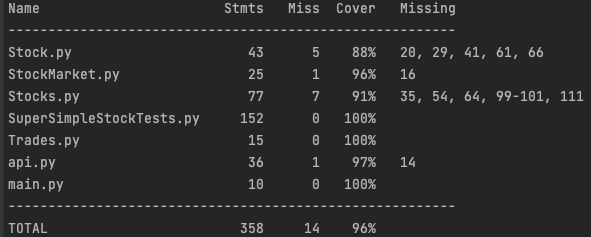

## **Super Simple Stock Market** 

### **Requirements**
___
1. The Global Beverage Corporation Exchange is a new stock market trading in drinks companies.

    a. Your company is building the object-oriented system to run that trading.

    b. You have been assigned to build part of the core object model for a limited phase 1

2. Provide the complete source code that will:-

    a. For a given stock:

        i. Given any price as input, calculate the dividend yield
        ii. Given any price as input, calculate the P/E Ratio
        iii. Record a trade, with timestamp, quantity, buy or sell indicator and price
        iv. Calculate Volume Weighted Stock Price based on trades in past 5 minutes

    b. Calculate the GBCE All Share Index using the geometric mean of the Volume Weighted Stock Price for all
stocks

### **Notes:**
____
This is my solution for the Simple Stock Market Project. Added an API built with FastAPI and a Uvicorn server to be able to interact
with the stock market. Given the time constraints and the scope, the stocks are input using a CSV File. Also, cause we aren't
initializing with previous stock information, trades will need to be entered to properly calculate VWAP/INDEX for stocks (since pricing data is required)

Potential Future Enhancements:
* Updating pricing information with background workers (Celery)
* Improved Testing
* Creating a logging micro service
* Adding improved I/O - Storing the trade history in a database 
* Adding more input validation
* Adding success and response codes
* Adding more class methods
* Improved API Functionality (Add/Remove Stock, Update Stock Information, Get Stock Data)

### **How to Set Up:**
____
    Download package
    Set up a virtual environment if you prefer:
    https://packaging.python.org/en/latest/guides/installing-using-pip-and-virtual-environments/
    
    Download requirements with pip: pip install -r requirements.txt
    
    Run Server: uvicorn main:app

### **Coverage**:

    To run coverage:
    coverage run -m SuperSimpleStockTests

    To get report:
    coverage report -m

### **Testing:**
____
    Due to size of project, I decided to keep tests in one file. I would break out and have more testing in an actual project
    python3 -m unittest SuperSimpleStockTests

### **API Endpoints:**
___
    GET /index/
    
    Ex: http://127.0.0.1:8000/index
    Params = NONE
    Returns GBCE ALL Share Index (float) using the geometric mean of the Volume Weighted Stock Price for all stocks
    Will return NAN if no trade back from some stocks 
    
    
    GET /stocks/per/

    Ex: http://127.0.0.1:8000/stocks/per/?ticker=TEA&price=70.5
    Params = ticker, price 
    Returns P.E Ratio for specified ticker. Returns NAN if not available

    GET /stocks/vwap/

    Ex: http://127.0.0.1:8000/stocks/vwap/?ticker=TEA
    Params = ticker 
    Returns Volume Weighted Stock Price for specified ticker. Returns NAN if not available
    
    
    GET /stocks/divyield/

    Ex: http://127.0.0.1:8000/stocks/divyield/?ticker=TEA&price=70.5
    Params = ticker, price 
    Returns P.E Ratio for specified stock. Returns NAN if not available

    POST /trade/
    
    Ex. http://127.0.0.1:8000/trade/?ticker=JOE&order_type=sell&quantity=100&price=500
    PARAMS = ticker, order_type (buy/sell), quantity, price
    Returns a trade successful response. Will return error if invalid ticker.

 

### **Main Classes:**
___

    - API Routes
    - StockMarket
    - Stocks
    - StockEnum
    - Stock
    - StockPricing - Made design decision to separate out the pricing information into own class 
    - StockFactory
    - CommonStock
    - PreferredStock
    - Trade
    - TradeHistory - Did not expand as out of the scope of this assignment - would want to store the history in 
    a separate database 

### **Example**:

    import StockMarket

    market = StockMarket.StockMarket("GBCE")
    market.stocks.loadStockDataFromCSV("<Path to CSV>")
    market.trade("TKR", "BUY", 100, 100)
    market.getIndex()
    market.stocks.getStockPER("TKR", 100)
    market.stocks.getStockDividendYield("TKR", 100)
    market.stocks.getStockVWAP("TKR")